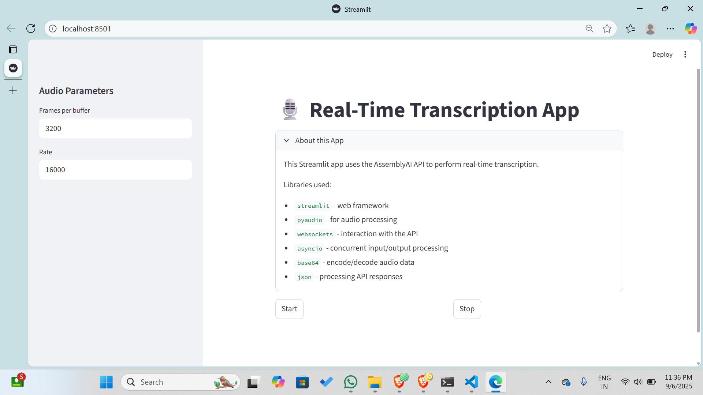

# 🎙️ Real-Time Transcription App  

A **Streamlit application** that captures audio from your microphone and transcribes it in real-time using the **AssemblyAI Realtime API**.  

---

## ✨ Features  
- 🎧 Live microphone audio streaming.  
- ⏱️ Real-time speech-to-text transcription.  
- 📂 Save transcripts automatically to a `.txt` file.  
- 📥 Download transcriptions directly from the UI.  
- 🖥️ Simple and interactive Streamlit web interface.  

---
<p align="center">
  
</p>
---

## 📦 Installation  

### 1️⃣ Clone the repository  
```bash
git clone https://github.com/classytamil/transcriber.git
cd realtime-transcription
```

### 2️⃣ Create a virtual environment and activate it  
```bash
python -m venv venv
# Activate:
# Windows:
venv\Scripts\activate
# Mac/Linux:
source venv/bin/activate
```

### 3️⃣ Install dependencies  
```bash
pip install -r requirements.txt
```

### 4️⃣ Set up your API key  
Create a file at `.streamlit/secrets.toml` and add:  
```toml
api_key = "your_assemblyai_api_key_here"
```

---

## ▶️ Usage  
Run the app with:  
```bash
streamlit run app.py
```

Then:  
1. Open the app in your browser.  
2. Adjust audio parameters (Frames per buffer, Rate) in the sidebar.  
3. Click **Start** to begin transcription.  
4. Click **Stop** to end.  
5. Download your transcription as `.txt`.  

---

## 📚 Tech Stack  
- [Streamlit](https://streamlit.io/) – UI Framework  
- [PyAudio](https://people.csail.mit.edu/hubert/pyaudio/) – Audio input  
- [AssemblyAI Realtime API](https://www.assemblyai.com/docs/Realtime) – Transcription service  
- [WebSockets](https://websockets.readthedocs.io/) – Realtime communication  
- `asyncio`, `base64`, `json` – Data handling  

---

## 📂 Project Structure  
```
.
├── app.py                  # Main application
├── requirements.txt        # Dependencies
├── README.md               # Documentation
└── .streamlit/
    └── secrets.toml        # API key
```

---

## 📜 License  
This project is licensed under the **MIT License**.  
